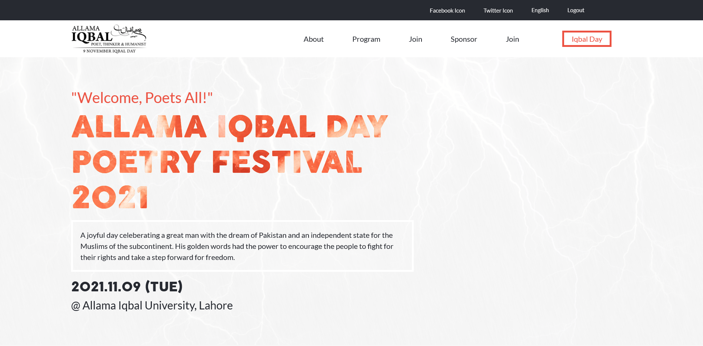

# Capstone Project - The Portal

> This is a demo website for a poetry festival in honor of Pakistan's national poet, a man of deep thought and beautiful verse.

Additional description about the project and its features.

## Built With

- Html
- CSS
- Javascript

## Live Demo

[Live Demo Link](https://livedemo.com)

## Author

👤 **Humaira Zaman**

- GitHub: [@qwibbler](https://github.com/qwibbler)
- Twitter: [@hmemaz](https://twitter.com/hmemaz)
- LinkedIn: [Humaira Zaman](https://www.linkedin.com/in/hmemaz1994/)

## 🤝 Contributing

Contributions, issues, and feature requests are welcome!

Feel free to check the [issues page](../../issues/).

## Show your support

Give a ⭐️ if you like this project!

## Acknowledgments

- Based on

## 📝 License

This project is [MIT](./MIT.md) licensed.
