# Capstone Project - The Portal

> This is a demo website for a poetry festival held in honor of Pakistan's national poet, a man of deep thought and beautiful verse.

# Screenshots
## Desktop
<!-- 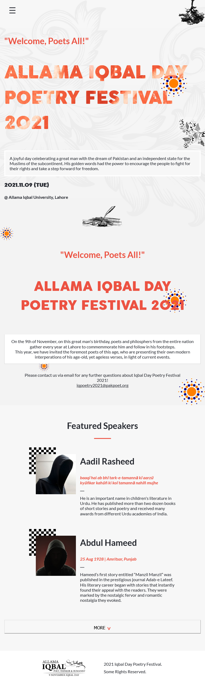 -->
### Header
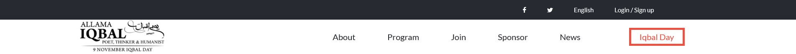
### Home Page
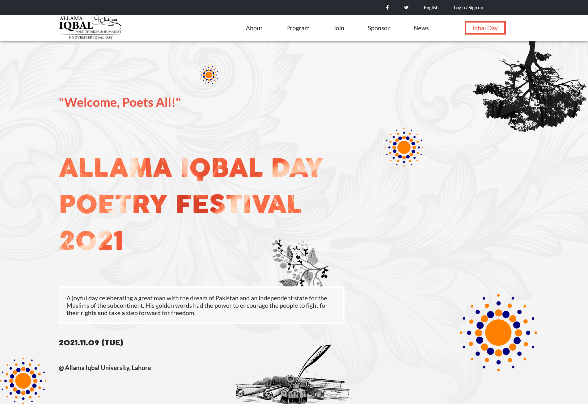
### About Page
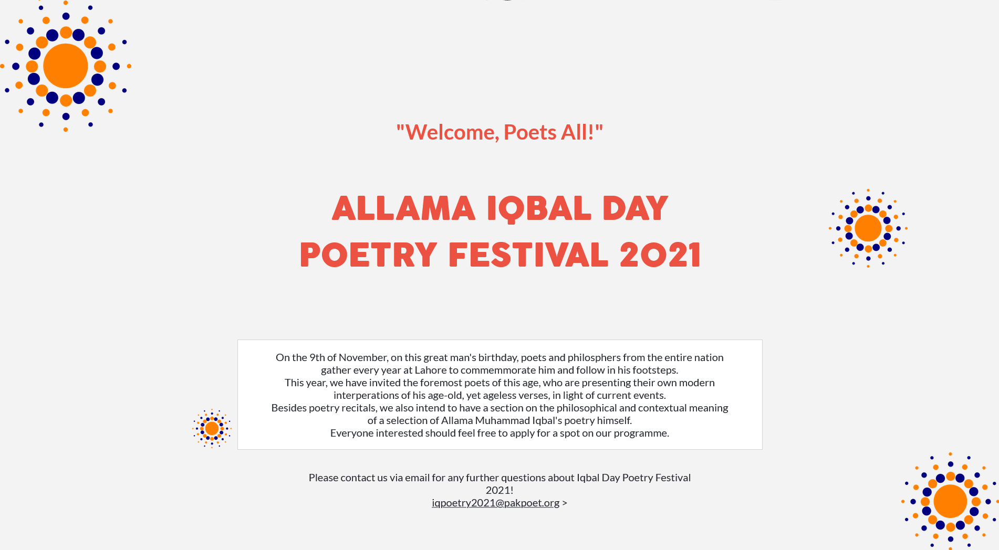
### Featured Speakers
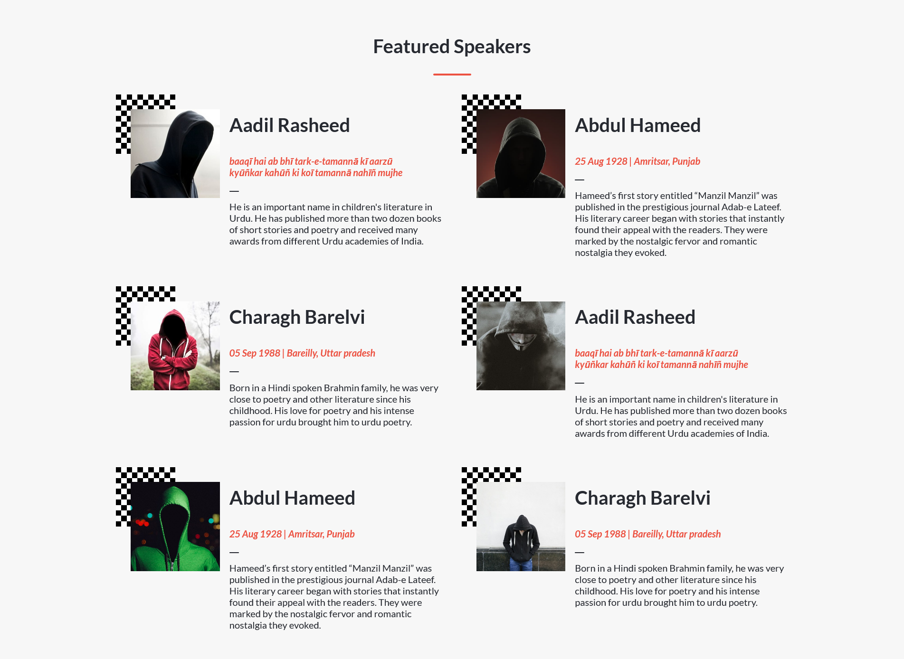
### Footer
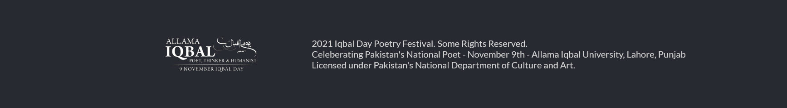

## Mobile
<!--  -->
### Home Page
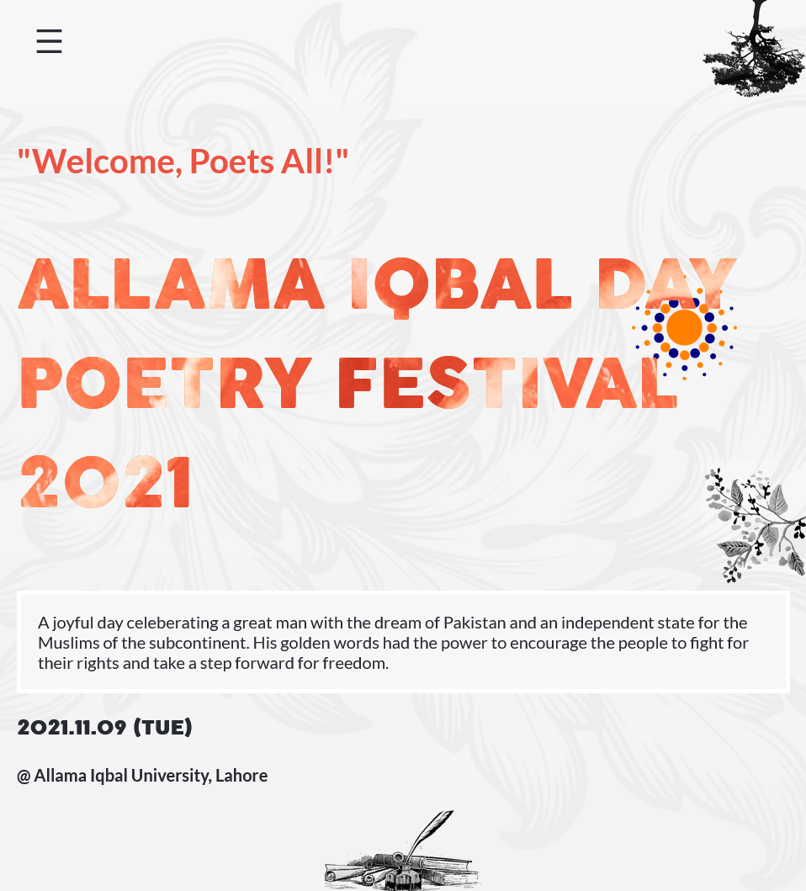
### About Page

### Featured Speakers
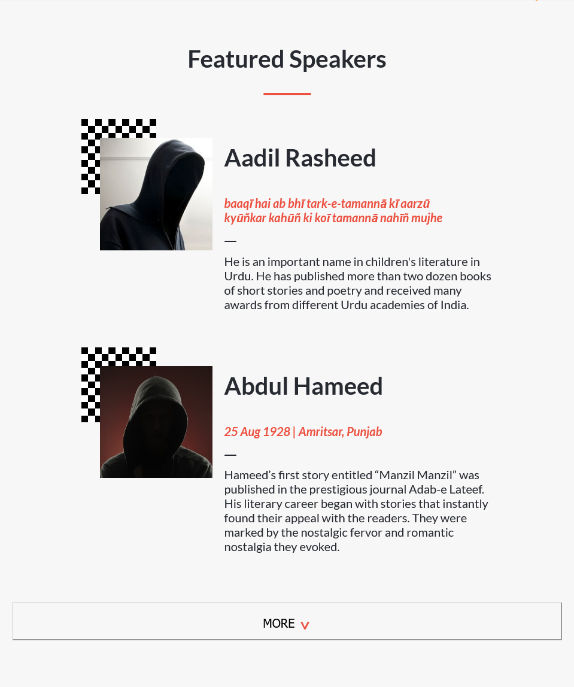
### Hamburger Menu
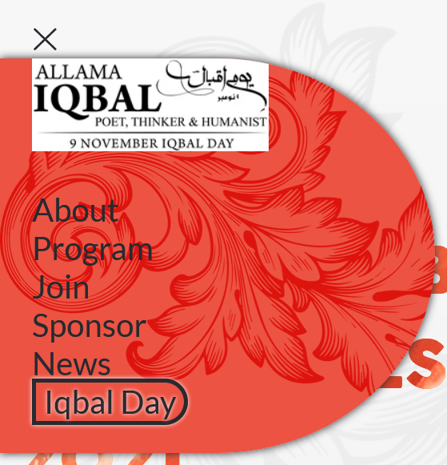
### Login / Sign up Form
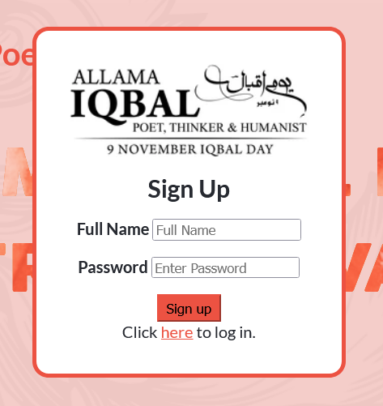
### Footer
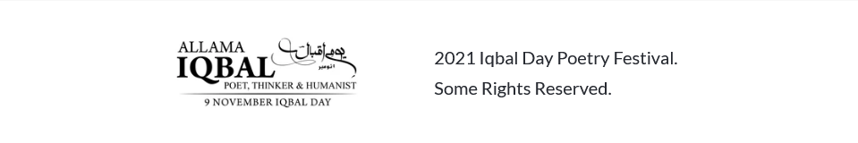

## Built With

- Html
- CSS
- Javascript

## Live Demo

[Live Demo](https://qwibbler.github.io/Capstone-Portal/)
[Loom Video](https://qwibbler.github.io/Capstone-Portal/)

## Author

👤 **Humaira Zaman**

- GitHub: [@qwibbler](https://github.com/qwibbler)
- Twitter: [@hmemaz](https://twitter.com/hmemaz)
- LinkedIn: [Humaira Zaman](https://www.linkedin.com/in/hmemaz1994/)

## 🤝 Contributing

Contributions, issues, and feature requests are welcome!

Feel free to check the [issues page](../../issues/).

## Show your support

Give a ⭐️ if you like this project!

## Acknowledgments

- Adapted from [this template](https://www.behance.net/gallery/29845175/CC-Global-Summit-2015), used under the [Creative Commons License](https://creativecommons.org/licenses/by-nc/4.0/).

## 📝 License

This project is [MIT](./LICENSE) licensed.
